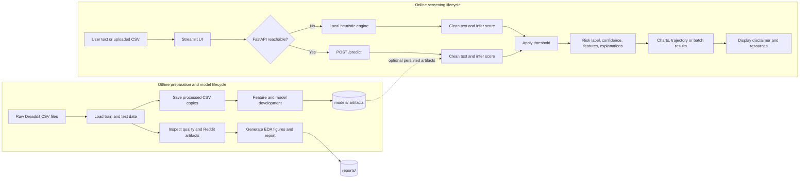
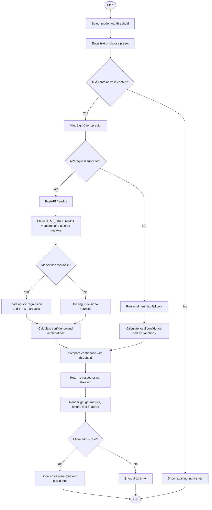
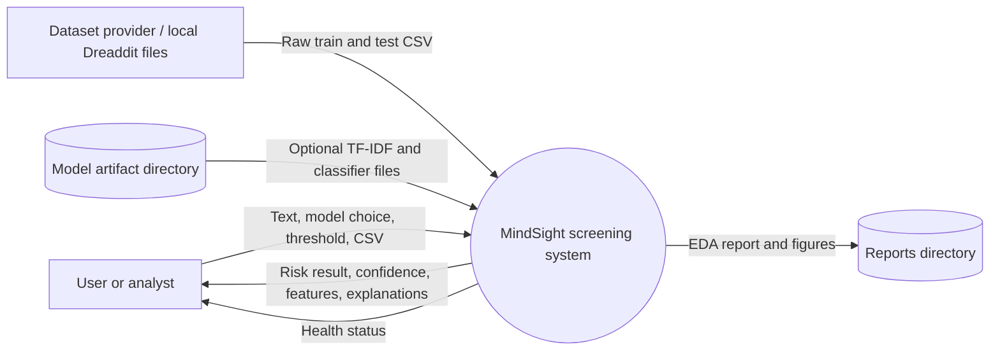
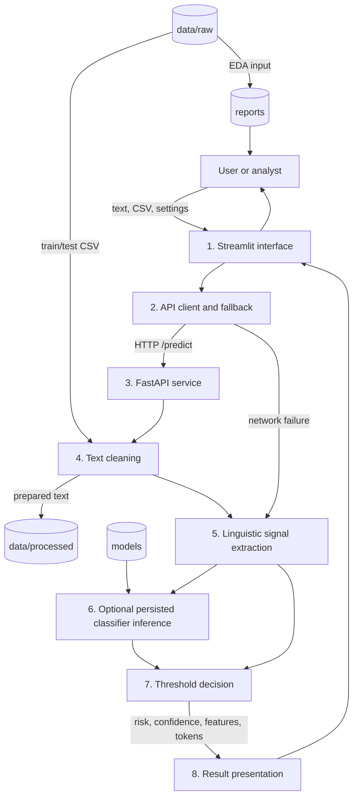
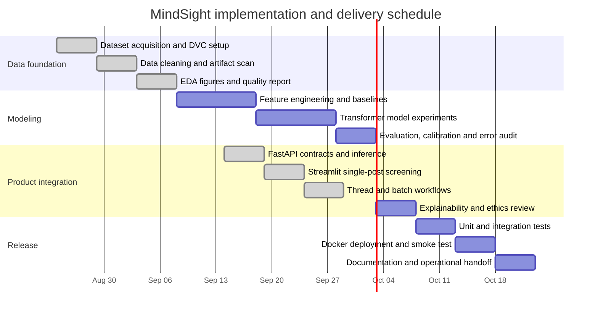

# MindSight Project Diagrams

These diagrams describe the workflow implemented by the repository as of August 2026.
MindSight is an assistive screening aid, not a diagnostic or clinical system.

## 1. End-to-End Process Diagram

The project has two connected lifecycles: an offline data/model lifecycle and an online screening lifecycle.

## 2. Single-Post Screening Flow Chart

## 3. Data Flow Diagrams

### 3.1 Context / Level 0 DFD

### 3.2 Level 1 DFD

### 3.3 Main Data Stores and Contracts

| Store or interface | Contents | Written/read by |
|---|---|---|
| `data/raw/` | `dreaddit-train.csv`, `dreaddit-test.csv` | Dataset pipeline |
| `data/processed/` | Cleaned CSV copies | Dataset pipeline |
| `models/` | Optional `logistic_regression.pkl` and `tfidf_vectorizer.pkl` | FastAPI inference |
| `reports/` | EDA Markdown report and generated figures | Dataset pipeline, analysts |
| `POST /predict` | Text, model type, threshold to risk response | Streamlit client, FastAPI |
| `POST /explain` | Text and threshold to explanation response | API consumers |
| `GET /health` | Service health status | Streamlit sidebar, operators |

## 4. Gantt Chart

This is a practical eight-week delivery schedule. The first three activities match the currently visible repository capabilities; model training, validation, and production hardening remain work items because their implementation is not present in `src/models`.

## 5. Scope Notes

- `/predict` uses persisted model files only when both expected files exist; otherwise it uses the API heuristic.
- The Streamlit client uses its own equivalent heuristic when the API is unavailable.
- Batch CSV screening and thread trajectory analysis call the same prediction client repeatedly.
- The current application does not persist user-entered screening text according to the UI's stated privacy behavior.
- The risk label is a thresholded screening signal and must not be interpreted as a diagnosis.